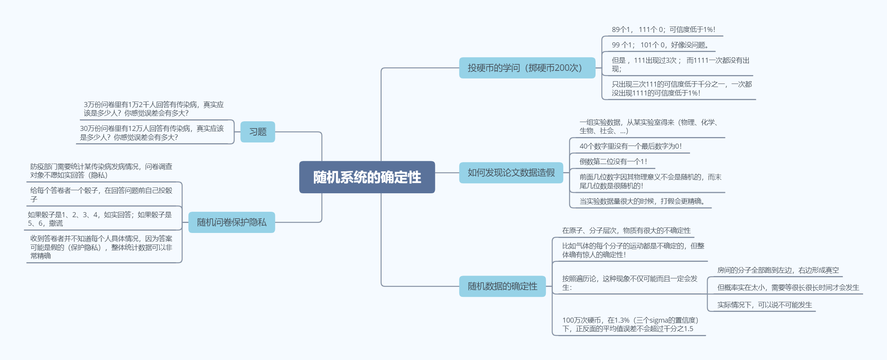
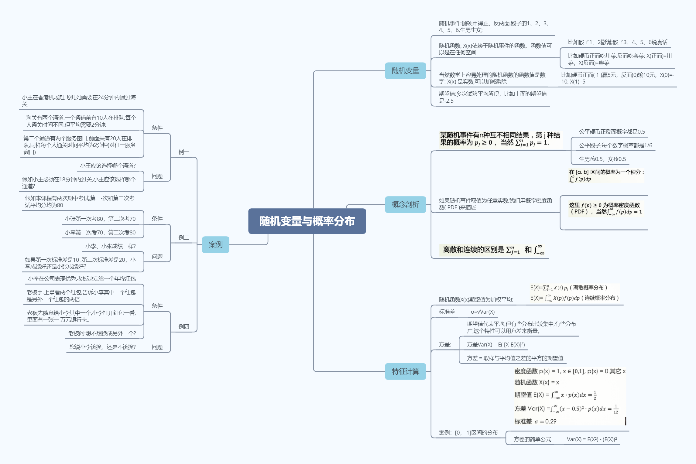
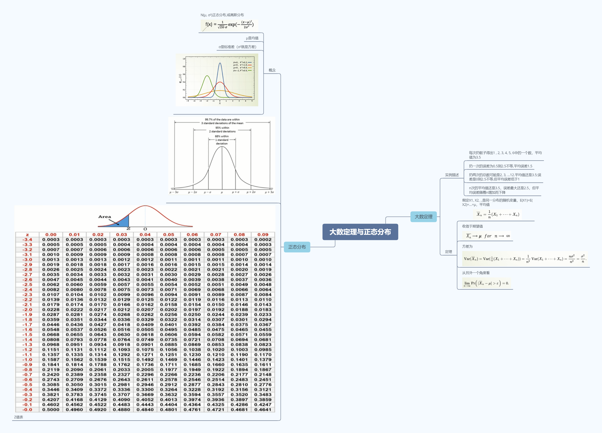
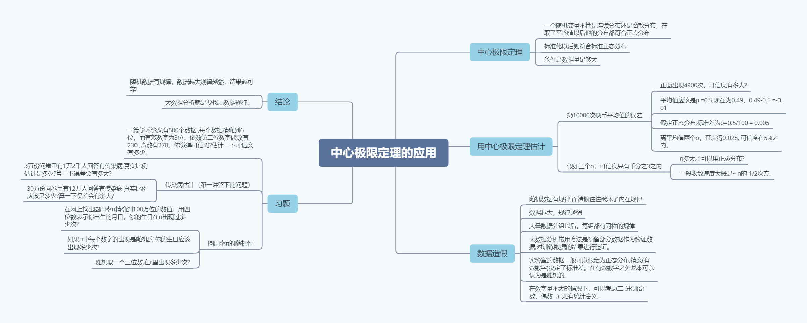

# The_mathematical_principles_of_big_data_analysis
Study notes for Professor Xia's course
> 大数据分析的数学原理

## 笔记
-  [第一讲 随机系统的确定性](https://github.com/APX103/The_mathematical_principles_of_big_data_analysis/blob/master/Study_note/%E7%AC%AC%E4%B8%80%E8%AE%B2%20%E9%9A%8F%E6%9C%BA%E7%B3%BB%E7%BB%9F%E7%9A%84%E7%A1%AE%E5%AE%9A%E6%80%A7.md)
-  [第二讲 随机变量与概率分布](https://github.com/APX103/The_mathematical_principles_of_big_data_analysis/blob/master/Study_note/%E7%AC%AC%E4%B8%89%E8%AF%BE%20%E5%A4%A7%E6%95%B0%E5%AE%9A%E7%90%86%E4%B8%8E%E6%AD%A3%E6%80%81%E5%88%86%E5%B8%83.md)
-  [第三课 大数定理与正态分布](https://github.com/APX103/The_mathematical_principles_of_big_data_analysis/blob/master/Study_note/%E7%AC%AC%E4%B8%89%E8%AF%BE%20%E5%A4%A7%E6%95%B0%E5%AE%9A%E7%90%86%E4%B8%8E%E6%AD%A3%E6%80%81%E5%88%86%E5%B8%83.md)
-  [第四讲 中心极限定理的应用](https://github.com/APX103/The_mathematical_principles_of_big_data_analysis/blob/master/Study_note/%E7%AC%AC%E5%9B%9B%E8%AE%B2%20%E4%B8%AD%E5%BF%83%E6%9E%81%E9%99%90%E5%AE%9A%E7%90%86%E7%9A%84%E5%BA%94%E7%94%A8.md)

## 学习小卡片

## 持续更新中！！
