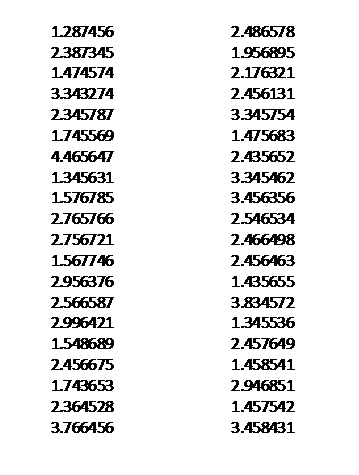

# 第一讲 随机系统的确定性

> 随机并非任意，随机系统的确定性的案例

## 一、  投硬币的学问。

掷硬币200次，其结果为

(01001101011001100101001011001011010010000101010010011000001101010011010101010010111010001101010100000100110101100110010100101100101111001000010101001001100000110101001101010101001011101000110101010000)

1. 89个1， 111个 0；可信度低于1%！

2. 99 个1； 101个 0，好像没问题。但是 ，111出现过3次 ； 而1111一次都没有出现！

3. 只出现三次111的可信度低于千分之一，一次都没出现1111的可信度低于1%！

> *相关求解代码见Code目录*

 
 
## 二、如何发现论文数据造假

  一组实验数据，从某实验室得来（物理、化学、生物、社会、…），怎么发现数据有没有问题

1. 40个数字里**没有一个**最后数字为0！

2. 倒数第二位没有一个1！

3. 前面几位数字因其物理意义不会是随机的，而末尾几位数是很随机的！

  当实验数据量很大的时候，打假会更精确。

 

## 三、随机数据的确定性

- 在原子、分子层次，物质有很大的不确定性

- 比如气体的每个分子的运动都是不确定的，但整体确有惊人的确定性！

- 按照遍历论，这种现象不仅可能而且一定会发生：

  - 房间的分子全部跑到左边，右边形成真空；

  - 但概率实在太小，需要等很长时间才会发生；

  - 实际情况下，可以说不可能发生。

100万次硬币，在1.3%（三个sigma）的置信度下，正反面的平均值误差不会超过千分之1.5。

 

## 四、随机问卷保护隐私

防疫部门需要统计某传染病发病情况，问卷调查对象不愿如实回答（隐私）。

可以给每个答卷者一个骰子，在回答问题前自己投骰子。如果骰子是1、2、3、4，如实回答；如果骰子是5、6，撒谎。

1. 收到答卷者并不知道每个人具体情况，因为答案可能是假的（保护隐私）。

2. 整体统计数据可以非常精确。

 

### 练习：

- 3万份问卷里有1万2千人回答有传染病，真实应该是多少人？你感觉误差会有多大？

- 30万份问卷里有12万人回答有传染病，真实应该是多少人？你感觉误差会有多大？
