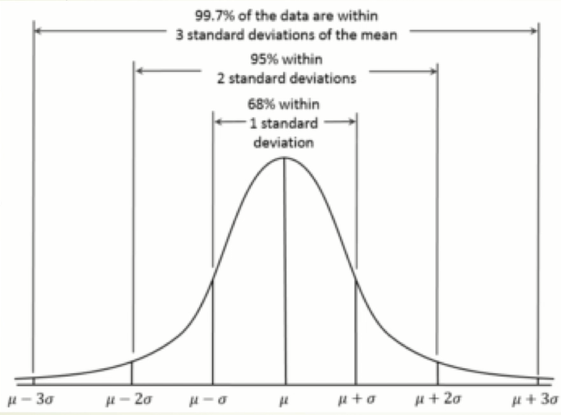
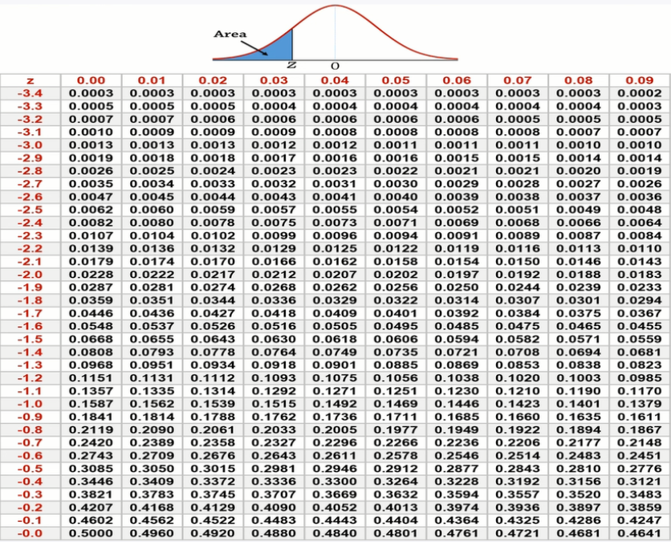

# 第三课 大数定理与正态分布

 

## 大数定理

概率论历史上第一个极限定理属于伯努利，后人称之为“大数定律”。概率论中讨论随机变量序列的算术平均值向随机变量各数学期望的算术平均值收敛的定律。

 

### **实例描述**

1. 每次扔骰子得出1, 2, 3, 4, 5, 6中的一个数，平均值为3.5

2. 扔一次的误差为0.5到2.5不等,平均误差1.5

3. 扔两次的总数可能是2, 3, ...12.平均值还是3.5;误差是0到2.5不等,但平均误差低于1

4. n次的平均值还是3.5，误差最大还是2.5，但平均误差随着n增加而下降

  定理

​    

**定理解析：**

  假定X1, X2, … 是同一分布的随机变量，E(X1) = E(X2) = … = μ，平均值

$\bar{X}_{n}=\frac{1}{n}\left(X_{1}+\cdots+X_{n}\right)$

  收敛于**期望值**

$\bar{X}_{n} \rightarrow \mu$ for $n \rightarrow \infty$

  **方差为**

$\operatorname{Var}\left(\bar{X}_{n}\right)=\operatorname{Var}\left(\frac{1}{n}\left(X_{1}+\cdots+X_{n}\right)\right)=\frac{1}{n^{2}} \operatorname{Var}\left(X_{1}+\cdots+X_{n}\right)=\frac{n \sigma^{2}}{n^{2}}=\frac{\sigma^{2}}{n}$

从另外一个角度看

$\lim _{n \rightarrow \infty} \operatorname{Pr}\left(\left|\bar{X}_{n}-\mu\right|>0\right)=0$（Pr是指概率）

一句话概括：**<u>随着样本容量n的增加，样本平均数将接近于总体平均数。</u>**

 

## 正态分布

正态分布（Normal distribution），也称“常态分布”，又名高斯分布（Gaussian distribution）。正态曲线呈钟型，两头低，中间高，左右对称因其曲线呈钟形，因此人们又经常称之为钟形曲线。

$f(x)=\frac{1}{\sqrt{2 \pi} \sigma} e^{-\frac{(x-\mu)^{2}}{2 \sigma^{2}}}$

若随机变量X服从一个数学期望为μ、方差为σ^2的正态分布，记为N(μ，σ^2)。其概率密度函数为正态分布的期望值μ决定了其位置，其标准差σ决定了分布的幅度。当μ = 0,σ = 1时的正态分布是标准正态分布。

 

**正态分布3σ原则为**：

- 数值分布在（μ-σ,μ+σ)中的概率为0.6826

- 数值分布在（μ-2σ,μ+2σ)中的概率为0.9544

- 数值分布在（μ-3σ,μ+3σ)中的概率为0.9974

可以认为，Y 的取值几乎全部集中在（μ-3σ,μ+3σ)区间内，超出这个范围的可能性仅占不到0.3%。

 

**标准正态分布表（Z值表）**

标准正态分布表 (n(0,1)，Φ（x），通过查找实数x的位置，从而得到p(z<=x))。表的纵向代表x的整数部分和小数点后第一位，横向代表x的小数点后第二位，然后就找到了x的位置。（可由概率反推x）

