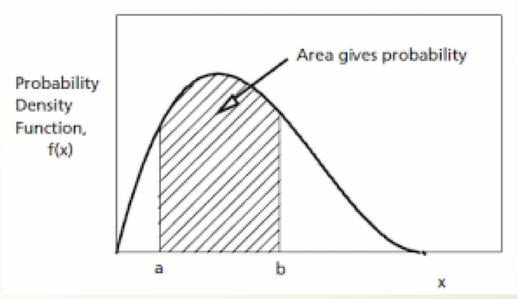

# 第二讲 随机变量与概率分布

 

### 随机变量

设试验E的样本空间为Ω，如果对于每一个样本点ω∈Ω，都有一个实数X (ω)与之对应，则称定义在Ω上的单值实值函数X (ω)为**随机变量**，简记为X . 通常用 X ,Y, Z 等表示随机变量.

 

### **概念解析：**

**随机事件**：抛硬币得正、反两面,骰子的1、2、3、4、5、6,生男生女。

**随机函数**: X(x)依赖于随机事件的函数。函数值可以是在任何空间。比如骰子1、2撒谎;骰子3、4、5、6说真话；比如硬币正面吃川菜,反面吃粤菜: X(正面)=川菜，X(反面)=粤菜。

**期望值**:多次试验平均所得（平均值又称数学期望）。

 

### 概率分布

随机事件分两种：

离散:n种可能，每种可能有个概率，第j种的概率是 ， 当然 

- 公平硬币正反面概率都是0.5

- 公平骰子,每个数字概率都是1/6

- 生男孩0.5，女孩0.5

 

连续: 如果随机事件取值为任意实数,我们用概率密度函数( PDF )来描述

如图，在[a, b]区间概率为一个积分E(x) = =\int_{a}^{b}f(p)dp)

这里的f(p)≥0为概率密度函数，当然，dp=1)

离散和连续的区别就在于   和 

 

### **特征计算：**

**随机函数X(x)期望值为加权平均：**

\-   **E(x) =** =\sum_{i=1}^{n}X(i)p_{i}) (离散概率分布)

\-   **E(x) =** =\int_{-\infty}^{+\infty}X(p)f(p)dp) (连续概率分布)

**方差：**

\-  期望值代表平均,但有些分布比较集中,有些分布广,这个特性可以用方差来衡量。

\-  方差 **Var**(X) = **E**([ **X** - **E**(**X**)]²)

\-  方差 = 取样与平均值之差的平方的期望值

**标准差：**

\-   **σ =**  })

### 案例

#### 一、赶飞机

小王在香港机场赶飞机,她需要在24分钟内通过海关，海关有两个通道,一个通道前有10人在排队,每个人通关时间不同,但平均需要2分钟;第二个通道有两个服务窗口,前面共有20人在排队,同样每个人通关时间平均为2分钟(对任一服务窗口)

- 小王应该选择哪个通道?（20）

- 假如小王必须在18分钟内过关,小王应该选择哪个通道?（10）

#### 二、 考试成绩对比

假如本课程有两次期中考试,第一-次和第二次考 试平均分均为80。小张第一次考80，第二次考70；小李第一次考70，第二次考80。

- 小李、小张成绩一样?（不能直接确定）

- 如果第一次标准差是10 ,第二次标准差是20，小李成绩好还是小张成绩好？（小张，标准差代表了全班同学的水平，由于第一次成绩的标准差小于第二次的标准差，标准差越小，成绩的离散性越小，小李第一次少考10分的排名比小张第二次少考10分的排名距离平均值的排名更靠后的）

#### 三、交换红包

小李在公司表现优秀,老板决定给一个年终红包。老板手上拿着两个红包,告诉小李其中一个红包是另外一个红包的两倍。老板先随意给小李其中一个,小李打开红包一看,里面有一张一万元银行卡。老板问:想不想换成另外一个？

- 您说小李该换、还是不该换？
